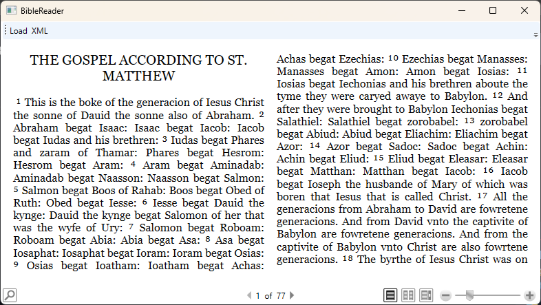

# BibleReader

This Bible Reader Windows application displays Bible files in the [`.usx` XML-based file format](https://markups.paratext.org/usx/). 


|*Tyndale's translation of Matthew from [fetch.bible](https://fetch.bible/content/bibles/)*|

## Development environment and running requirements

The Reader is written in C# (.NET Core 8). The GUI is written with [WPF](https://learn.microsoft.com/en-us/dotnet/desktop/wpf/overview/?view=netdesktop-9.0). To run the application, you will need:

- Windows
- .NET runtime

## Build and run

1. Download or clone the repository
2. ```cd BibleReader```
3. ```dotnet run```

## Run tests

1. Download or clone the repository
2. ```cd BibleReader.Tests```
3. ```dotnet test```

## References

- USX specification: [https://markups.paratext.org/usx/](https://markups.paratext.org/usx/)
- Windows Presentation Foundation: [https://learn.microsoft.com/en-us/dotnet/desktop/wpf/overview/?view=netdesktop-9.0](https://learn.microsoft.com/en-us/dotnet/desktop/wpf/overview/?view=netdesktop-9.0)